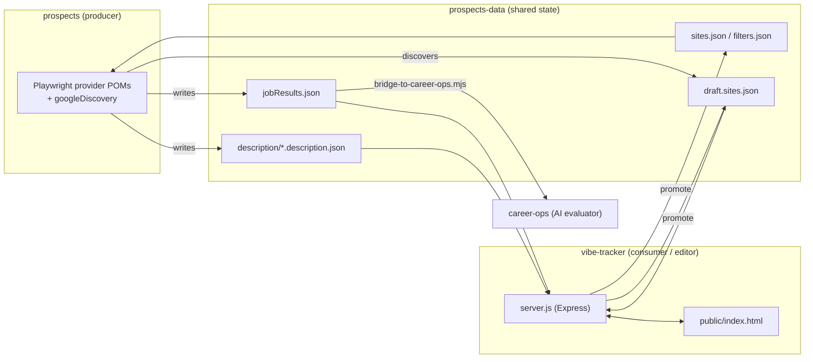
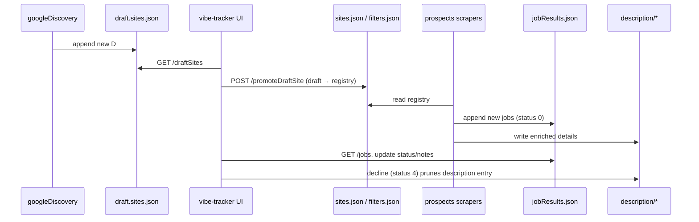

# Vibe-Tracker + Prospects — Design Document

Status: **as-built documentation + proposed feature designs (planning).**
Scope: the `vibe-tracker` UI, the `prospects` scraping pipeline, and the
`prospects-data` shared data repository. Covers the current system and a
concrete plan for three new features.

> **Decisions confirmed 2026-07-25.** Every decision point below is now locked
> at its recommended default (see the §8 summary). One addition was made during
> review: description entries will carry their own `date` field (**D3.6**),
> which removes the join/ordering dependency from the purge (§7.3). This pass is
> **documentation only** — implementation is a separate, later change.

> **How to read the feature sections:** each proposal ends with a
> **Decision points** list. Each is marked **Confirmed** with the chosen option;
> these are the choices that drive the implementation.

---

## 1. Ecosystem overview

Four repositories cooperate. Three are in scope for this document; `career-ops`
is the downstream consumer.



- **`prospects`** — a Playwright job-aggregation pipeline. Scrapes career
  portals (Eightfold, Greenhouse, Ashby, Lever, SmartRecruiters, Recruitee,
  ADP, Applitrack, SchoolSpring, ATJ) plus a Google-based site discovery step.
  **Produces** `jobResults.json` and `description/`, **discovers** new sites
  into `draft.sites.json`, and **reads** the `sites.json` / `filters.json`
  registries.
- **`prospects-data`** — a private repo holding all mutable state. Checked out
  by CI as `prospects/test-data/`. Owns the JSON schemas in `schema/` that form
  the **data contract** between the repos.
- **`vibe-tracker`** — an Express server + single static HTML page. **Consumes**
  `jobResults.json` for display, **edits** job status/notes, and **manages** the
  draft-site review workflow (promote / dismiss).
- **`career-ops`** — downstream AI evaluation, fed one-way by
  `prospects/bridge-to-career-ops.mjs`. Out of scope here.

### Repository wiring

`prospects-data` is not committed inside `prospects`; CI checks it out as the
`test-data/` subdirectory. `vibe-tracker/server.js` defaults its data paths to
`../prospects/test-data/…` (a sibling checkout) but every path is
environment-overridable, which is what makes the tests hermetic.

---

## 2. Data model and the shared contract

All state is plain JSON in `prospects-data`. The `schema/` directory holds
JSON-Schema (draft-07) definitions that `vibe-tracker` requires; the
`data-check.yml` workflow validates every data change against them and then
boots the real `vibe-tracker` server against the changed data.

### 2.1 `jobResults.json` — the persistent results store

Keyed by **org name**, plus a `Status Definitions` map. Contract:
`jobResults.schema.json`.

```jsonc
{
  "Status Definitions": { "0": "new job", "1": "applied", "2": "recieved reply",
                          "3": "interviewing", "4": "declined" },
  "Twilio": {
    "Site": "Twilio",
    "URL": "https://twilio.eightfold.ai",
    "jobs": [
      { "id": "446718414598", "title": "SDET", "status": "0",
        "date": "2026-05-13", "notes": "", "link": "https://…" }
    ]
  }
}
```

- Every job requires `id`, `title`, `status` (`"0"`–`"4"`), `date`. `notes`
  and `link` are optional.
- `date` is `YYYY-MM-DD`. **It is the only timestamp anywhere in the data
  model** — a fact that drives the 90/30-day purge design (§7.3).

### 2.2 `description/<Org>.description.json` — enriched detail

One file per org, keyed by org name. Contract: `description.schema.json`.

```jsonc
{
  "Twilio": {
    "jobs": [
      { "title": "SDET", "JobID": "446718414598", "Department": "",
        "URL entity": "446718414598", "Description": "…" }
    ]
  }
}
```

- **Join key:** `"URL entity"` in a description entry equals `id` of the
  matching job in `jobResults.json` for the same org. Verified against live
  data (e.g. Twilio: 18/18 description entities map to jobResults ids).
- **No date field today** — description age is currently knowable only by
  joining to the matching `jobResults` job's `date`. **Planned change (D3.6):**
  add a `date` field to each description entry so age is self-contained. A
  one-time backfill stamps existing entries from the join; go-forward,
  `Utilities.writeDetails` stamps the field at write time. This removes the join
  and the ordering dependency from the 30-day description purge (§7.3).
- The schema only *requires* `"URL entity"` (that's what the tracker's decline
  flow filters on); the other fields are conventional. After D3.6 the schema
  gains an optional `date` (`YYYY-MM-DD`), kept optional so pre-backfill files
  still validate.

### 2.3 `sites.json` — the site registry (non-Eightfold)

Employers grouped by category. Each entry: `{ id, org, URL, Provider }`.

| Category | ID prefix | Live count |
|---|---|---|
| Private | `P` | 23 |
| Public | `I` | 25 |
| Universities | `U` | 3 |
| Sites | `S` | 7 |
| Recruiters | `R` | 42 |
| Employers | `E` | 93 |

### 2.4 `filters.json` — Eightfold tenants

Eightfold employers live **here, not in `sites.json`**. Contract:
`filters.schema.json`.

- Every key except `sdetOnly` is a filtered tenant: `{ id: "E8xx", org,
  subdomain, domain, baseUrl, filters }`.
- `sdetOnly` is an object of filter-less tenants (same fields **minus**
  `filters`). This is where the tracker's promote flow lands new Eightfold
  drafts.

### 2.5 `draft.sites.json` — discovery inbox

`{ "Draft": [ { id: "D####", org, URL, Provider } ] }`. Contract:
`draftSites.schema.json`. Populated by `googleDiscovery`, drained by the
tracker's promote/dismiss flow.

### 2.6 Name-matching caveat (important for §7.2)

The registries key on **org name**, and the same org name is used as the
`jobResults` vendor key and the `description` filename — but they are not
guaranteed identical. Only **115 of 193** `sites.json` entries have an `org`
that exactly matches a `jobResults` key (many registered sites simply have no
results yet; some differ by punctuation/case, e.g. `Ten Mile Square
Tecnologies` vs `TenMileSquareTechnologies`). `Utilities.getSiteJobIds`
(`prospects/classes/utilities.ts`) already compensates with a trim +
case-insensitive reverse lookup. Any feature that deletes "a site and all its
data" must use the same tolerant matching and tolerate partial hits.

---

## 3. vibe-tracker — current design

A ~380-line Express server (`server.js`) and one ~970-line static page
(`public/index.html`). No build step, no framework, no database.

### 3.1 Server endpoints

| Method | Route | Purpose |
|---|---|---|
| GET | `/jobs` | Whole `jobResults.json`. |
| GET | `/vendors` | Vendor/org names (for the add-job dropdown). |
| GET | `/draftSites` | `draft.sites.json` `Draft` array. |
| POST | `/addJob` | Add a job to a vendor; create the vendor if `NEW_VENDOR`. |
| POST | `/updateStatus` | Set a job's status. **Status `4` (declined) also prunes the matching entry from that org's description file.** |
| POST | `/updateNotes` | Set a job's notes. |
| POST | `/promoteDraftSite` | Move a draft out of `draft.sites.json`: Eightfold → `filters.json` `sdetOnly` (needs `domain`); everything else → a `sites.json` category. |
| POST | `/dismissDraftSite` | Delete a draft from `draft.sites.json` with no promotion. |

Supporting helpers: `generateNextSiteId` (per-category `P/I/U/S/R/E` id with
preserved zero-padding), `generateNextEightfoldId` (`E8xx` range scanned across
`filters.json` root + `sdetOnly`), `deriveEightfoldFields` (subdomain/baseUrl
from a draft URL).

### 3.2 Path configuration (the testability seam)

Every data path is env-overridable; defaults point at the sibling checkout:

| Env var | Default |
|---|---|
| `DATA_FILE` | `../prospects/test-data/jobResults.json` |
| `DESCRIPTION_DIR` | `../prospects/test-data/description` |
| `DRAFT_SITES_FILE` | `../prospects/test-data/draft.sites.json` |
| `SITES_FILE` | `../prospects/test-data/sites.json` |
| `FILTERS_FILE` | `../prospects/test-data/filters.json` |
| `PORT` | `3000` |

The server reads each file **on every request** (no in-memory cache), so tests
reset state simply by rewriting the fixture files between cases.

### 3.3 Frontend

Single page, vanilla JS, `fetch` against the endpoints above:

- **Jobs table** — search by title/id, filter by site, sorted by a
  status-priority order (reply → interviewing → new → applied → declined),
  then date desc. Inline status `<select>`, notes `<textarea>`, and a decline
  checkbox per row; a `NEW` badge for status `0`.
- **Add-job form** — pick an existing vendor or create a new one.
- **Draft Sites panel** — toggled open; lists drafts with a category `<select>`
  (or a domain text box for Eightfold rows) and Promote / Dismiss buttons.
- **Dark mode** — persisted in `localStorage`.

### 3.4 Tests & CI

- Playwright specs in `test/`, split `smoke` / `regression`. `test/helpers/data.js`
  copies `test/fixtures/` into an OS temp dir and points the server at it via
  the env vars above — **tests never touch real data.**
- `pr.yml` runs both suites and flags PRs that change `server.js` or
  `index.html` without touching a test. `claude-review.yml` /
  `claude-issue-autofix.yml` provide labelled auto-review and auto-fix.

---

## 4. prospects — discovery subsystem (current design)

Beyond the per-provider scrapers, `prospects` runs a Google-based **site
discovery** step that feeds the tracker's draft inbox.

- **`pages/googleDiscovery.ts`** — for each provider in `PROVIDERS` (ashby,
  greenhouse, lever, smartrecruiters, recruitee, eightfold), searches Google
  for `site:<domain> +sdet`, scrapes up to 3 result pages, and reduces each
  hit to a canonical board URL via a provider-specific `extractUrl` regex (the
  same regex the provider's page object already applies). Derives a best-effort
  `org` name from the result title or URL slug.
- **`pages/googleDiscoveryWriter.ts`** — `writeDraftSites()` merges discoveries
  into `draft.sites.json`, **skipping anything already known**. "Known" =
  `Utilities.URLS` (all registered sites, both `sites.json` and every Eightfold
  tenant) **plus** existing draft entries. Dedup uses a `canon()` normaliser
  that strips a trailing `/careers` and trailing slash so an Eightfold site
  discovered as `https://x.eightfold.ai/careers` matches its stored
  `https://x.eightfold.ai` baseUrl. New entries get sequential `D####` ids.
- **`tests/googleDiscovery.spec.ts`** — drives `discoverProvider` per provider
  under a CDP browser and calls `writeDraftSites`.

**This dedup set is the exact extension point for the block file (§7.1):** a
blocked URL simply needs to join the "known" set so a rediscovered site is
never re-drafted.

---

## 5. End-to-end data flow



Steady-state loop: **discover → review/promote → scrape → track**. The three
proposed features close gaps in this loop — preventing re-discovery of rejected
sites, allowing full removal of a registered site, and bounding data growth
over time.

---

## 6. Cross-cutting design principles (apply to all new work)

1. **Preserve the env-path seam.** Every new file the server touches (e.g.
   `blocked.sites.json`) gets a `*_FILE` env override and a fixture, so the
   Playwright suites stay hermetic.
2. **Honor the schema contract.** New shared files get a `schema/*.schema.json`
   and an entry in `data-check.yml` (validation paths + the boot smoke).
   Existing schemas must keep validating.
3. **Tolerant org matching.** Anything that resolves a site to its results or
   description must mirror `Utilities.getSiteJobIds` (trim + case-insensitive),
   and degrade gracefully when a site has no results/description yet.
4. **Reuse `canon()`** for any URL-identity comparison across providers.
5. **Guard the blast radius of bulk deletes.** Current writes are
   `readFileSync`/`writeFileSync` (non-atomic). Deleting many rows at once
   raises the cost of a mid-write crash — new destructive operations should
   write-then-rename (or take a `.bak`, as `applied.json.bak` already models).

---

## 7. Proposed features

### 7.1 Block file for demoted draft sites (`blocked.sites.json`)

**Goal.** When a site is demoted out of `draft.sites.json`, remember it so
`googleDiscovery` never re-drafts it on a future SDET search.

**New file:** `prospects-data/blocked.sites.json`, mirroring the draft shape
plus provenance:

```jsonc
{
  "Blocked": [
    { "id": "B0001", "org": "Certa", "URL": "https://jobs.ashbyhq.com/Certa",
      "Provider": "ashby", "blockedAt": "2026-07-25", "source": "dismiss" }
  ]
}
```

Identity for dedup is the **canonical URL** (`canon(URL)`), not the id — the
same normalisation discovery already uses.

**vibe-tracker changes.**
- Add `BLOCKED_SITES_FILE` env override (+ fixture).
- `POST /dismissDraftSite`: before removing the draft, append its
  `{ org, URL, Provider }` to `blocked.sites.json` with `source: "dismiss"`,
  de-duplicated by canonical URL. (Dismiss == demote == block.)

**prospects changes.**
- `googleDiscoveryWriter.writeDraftSites()`: load `blocked.sites.json`
  (tolerate a missing file) and fold `canon(blockedURL)` into the existing
  `knownUrls` set. One line of set-union; the skip logic already exists.

**prospects-data changes.**
- Add `schema/blockedSites.schema.json` (same required fields as draft:
  `id, org, URL, Provider`).
- Add `blocked.sites.json` to `data-check.yml` validation paths.

**Tests.** vibe-tracker regression: dismissing a draft writes it to the block
file (and is idempotent on re-dismiss of the same URL). prospects unit-level:
`writeDraftSites` skips a discovery whose canonical URL is blocked.

**Decision points.** *(All confirmed 2026-07-25.)*
- **D1.1** Block identity — **Confirmed: canonical URL** (`canon(URL)`), matching
  discovery dedup.
- **D1.2** What feeds the block file — **Confirmed: dismiss-a-draft *and*
  delete-a-site** (§7.2, per D2.3), closing the re-discovery loop.
- **D1.3** Block expiry — **Confirmed: keep forever.** Revisit only if the list
  grows unwieldy.

---

### 7.2 Delete a registered site from the vibe-tracker UI

**Goal.** Remove a site that's already in the registry, and clean up everything
derived from it: the registry entry, its `jobResults.json` vendor block, and
its `description/<org>.description.json` file.

**New endpoint:** `POST /deleteSite` with `{ siteId }` (or `{ org }`). Steps:
1. Resolve the site in `sites.json` (by id across categories) → `{ org,
   Provider }`. *(Eightfold coverage: see D2.2.)*
2. Remove that entry from its `sites.json` category array.
3. Remove the matching **vendor block** from `jobResults.json`, using tolerant
   org matching (§6.3). If no match, that's fine — report it.
4. Delete `description/<org>.description.json` if it exists.
5. Optionally append to `blocked.sites.json` (per D1.2).
6. Respond with a summary of what was actually removed (registry yes /
   jobResults yes|absent / description yes|absent), so partial cleanups are
   visible rather than silent.

**New read endpoint:** `GET /sites` returning `sites.json` (grouped), to drive
the UI list. *(Optionally include Eightfold tenants per D2.2.)*

**Frontend.** A **"Manage Sites"** panel modelled on the existing Draft Sites
panel: sites grouped by category, each row with a **Delete** button behind a
typed/confirm dialog that spells out the three artifacts being removed. Reuse
the panel's toggle + re-fetch-before-reveal pattern.

**prospects-data changes.** None structurally — the operation mutates existing
files. `data-check.yml` still validates the results.

**Tests.** New `deleteSite.spec.js`: deletion removes the `sites.json` entry,
the `jobResults.json` vendor, and the description file; is idempotent; handles
the **name-mismatch** case (registry `org` differs from the `jobResults`
key/description filename) by still deleting the registry row and reporting the
misses.

**Risks / notes.**
- **Name mismatch is the main hazard** (§2.6). Without tolerant matching a
  delete could orphan `jobResults`/`description` data. Tests must cover it.
- **Concurrency:** the `prospects` CI run commits `jobResults.json` back to
  `prospects-data`. A UI delete during a run could be overwritten. Acceptable
  for a single-user tool; noted, not solved here.
- **Non-atomic writes** (§6.5) — apply the write-then-rename guard.

**Decision points.** *(All confirmed 2026-07-25.)*
- **D2.1** UI placement — **Confirmed: dedicated "Manage Sites" panel** (modelled
  on the Draft Sites panel), not a delete bolted onto the site filter.
- **D2.2** Scope — **Confirmed: `sites.json` *and* Eightfold tenants** in
  `filters.json` (root + `sdetOnly`), making delete symmetric with promote.
- **D2.3** Also block on delete — **Confirmed: yes** (feeds the block file per
  D1.2, `source: "delete"`).

---

### 7.3 Time-based purge — 90-day jobResults, 30-day descriptions

**Goal.** Bound data growth: delete `jobResults.json` jobs older than 90 days,
and remove `description` entries for jobs older than 30 days. (Live data today:
47 of 1270 jobs are already >90 days old.)

**The former load-bearing constraint — now removed by D3.6.** Descriptions
historically had **no timestamp** (§2.2), so a description entry's age was only
knowable by joining `"URL entity"` → `jobResults` `id` → `date`. That forced a
strict **ordering dependency** (description purge first, while dates still
exist) and left orphan entries undatable.

**D3.6 gives each description entry its own `date`,** so the description purge
reads that field directly. The join is needed exactly once — for the one-time
backfill — and never again:

> **No ordering dependency after backfill.** The 30-day description purge and
> the 90-day jobResults purge are independent and may run in either order. The
> description purge no longer reads `jobResults` at all.

**Migration (one-time backfill, `backfillDescriptionDates.mjs`).** For each
`description/<org>.description.json`, load the org's `jobResults` `id → date`
map and stamp `date` onto every entry via `"URL entity"`. Orphan entries (no
matching job) get no date from the join; stamp them with the run date so they
become datable and purge normally thereafter. Idempotent: entries that already
have a `date` are left untouched. Run once, before the purge is first enabled.

**Go-forward write (D3.6).** `Utilities.writeDetails` (`classes/utilities.ts`)
adds `date` to each `incoming` entry. Source: the matching `jobResults` job's
`date` when available, else the run date (`new Date().toISOString().slice(0,10)`).
`mergeUnique` already dedupes by `JobID`, so existing entries keep their
original stamped date — only genuinely new entries are dated.

**Algorithm (per org, single pass) — post-D3.6:**
1. **Description purge:** in `description/<org>.description.json`, drop each
   entry whose own `date` is >30 days old (D3.2 status policy does **not** apply
   to descriptions — they carry no status). Delete the file if it becomes empty.
   No `jobResults` read required.
2. **jobResults purge:** drop each job with `date` >90 days old, subject to the
   status policy (D3.2). Remove the vendor block if `jobs` becomes empty
   (D3.3). Never touch `Status Definitions`.

**Ownership.** Implement as a reusable `purgeStaleData()` in
`prospects/classes/utilities.ts`, invoked by `globalTeardown` **after**
`consolidateBatchWrites()` — it runs on the self-hosted CI runner that already
commits `test-data/` back to `prospects-data`, so no new schedule or
credentials are needed. Add a thin CLI wrapper (`node purge.mjs --dry-run`,
mirroring `bridge-to-career-ops.mjs`) for manual/audited runs. `vibe-tracker`
is a poor fit — it's an on-demand UI server, not a scheduled job.

**Configuration.** `JOB_RESULTS_TTL_DAYS=90`, `DESCRIPTION_TTL_DAYS=30`,
`--dry-run`. Cutoffs measured from run time against the `date` field.

**Schema/CI.** The `jobResults` purge needs no schema change. **D3.6 adds an
optional `date` (`YYYY-MM-DD`) to `description.schema.json`** — kept *optional*
so files that predate the backfill still validate, and so the `additionalProperties`
job shape stays permissive. Mirror the same field in the `JobDetails` /
description-entry shape in `classes/utilities.ts`. `data-check.yml` keeps
validating the (smaller, now-dated) description files.

**Decision points.** *(All confirmed 2026-07-25.)*
- **D3.1** Owner — **Confirmed: prospects `globalTeardown` + CLI wrapper**
  (`node purge.mjs --dry-run`, mirroring `bridge-to-career-ops.mjs`). Runs on the
  self-hosted CI runner that already commits `test-data/` back; no new schedule
  or credentials.
- **D3.2** Purge policy — **Confirmed: protect active applications.** Purge only
  status `0` (new) and `4` (declined) past 90 days; never `1/2/3` regardless of
  age. (Applies to `jobResults` only; descriptions carry no status.)
- **D3.3** Empty vendor blocks — **Confirmed: remove** the vendor block when its
  `jobs` empties. `sites.json` remains the source of truth.
- **D3.4** Orphan description entries — **Confirmed: prune.** After D3.6 they are
  datable (backfill stamps them with the run date), so they purge by their own
  `date` on the normal 30-day rule rather than as a special case.
- **D3.5** Run cadence — **Confirmed: every CI run** (piggybacks the existing
  teardown; ties to D3.1).
- **D3.6** *(new)* Description entries carry their own **`date`** — **Confirmed.**
  One-time `backfillDescriptionDates.mjs` populates existing entries from the
  `jobResults` join; `Utilities.writeDetails` stamps the field going forward;
  `description.schema.json` gains an optional `date`. Rationale: `globalTeardown`
  no longer joins to `jobResults` for the description purge, and the two purges
  become order-independent.

---

## 8. Decision summary

All confirmed 2026-07-25 at the recommended default.

| # | Decision | Confirmed |
|---|---|---|
| D1.1 | Block-file identity | Canonical URL |
| D1.2 | What feeds the block file | Dismiss **and** delete-site |
| D1.3 | Block expiry | Keep forever |
| D2.1 | Delete-site UI placement | New "Manage Sites" panel |
| D2.2 | Delete-site scope | `sites.json` **+** Eightfold `filters.json` |
| D2.3 | Block on delete | Yes (`source: "delete"`) |
| D3.1 | Purge owner | prospects `globalTeardown` + CLI |
| D3.2 | Purge policy | Protect active statuses (purge only 0 & 4) |
| D3.3 | Empty vendor blocks | Remove |
| D3.4 | Orphan descriptions | Prune (datable after D3.6 backfill) |
| D3.5 | Purge cadence | Every CI run |
| D3.6 | `date` on description entries | Yes — backfill + `writeDetails` stamp; removes the purge join/ordering dependency |

### Files touched per feature

| Feature | prospects-data | prospects | vibe-tracker |
|---|---|---|---|
| 7.1 Block file | `blocked.sites.json`, `schema/blockedSites.schema.json`, `data-check.yml` | `googleDiscoveryWriter.ts` | `server.js` (`/dismissDraftSite`, env path), fixture + test |
| 7.2 Delete site | (data mutated) | — | `server.js` (`/deleteSite`, `/sites`), `index.html` (Manage Sites panel), fixtures + `deleteSite.spec.js` |
| 7.3 Purge | `description.schema.json` (optional `date`), `data-check.yml` | `utilities.ts` (`purgeStaleData` + `writeDetails` date stamp + `JobDetails` shape), `globalTeardown.ts`, `purge.mjs`, `backfillDescriptionDates.mjs` | — |

---

## 9. Suggested sequencing

1. **7.1 block file** — smallest, self-contained, and the block-on-dismiss half
   is fully specified. Establishes `blocked.sites.json` + its schema.
2. **7.2 delete site** — depends on 7.1 only for the optional block-on-delete
   hook (D2.3); can land independently otherwise.
3. **7.3 purge** — independent of 1 & 2; lives in `prospects`. Order within the
   feature: (a) add the optional `date` to `description.schema.json` and the
   `writeDetails` stamp, (b) run `backfillDescriptionDates.mjs` **once** so every
   existing entry is dated, (c) only then enable `purgeStaleData()` in
   `globalTeardown`. The status policy (D3.2) is confirmed but stays
   irreversible against already-purged data, so the first live run should be a
   `--dry-run` audit.
